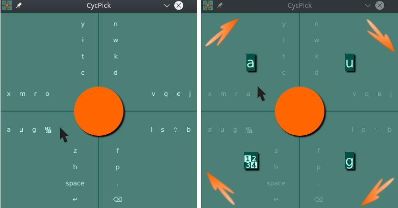
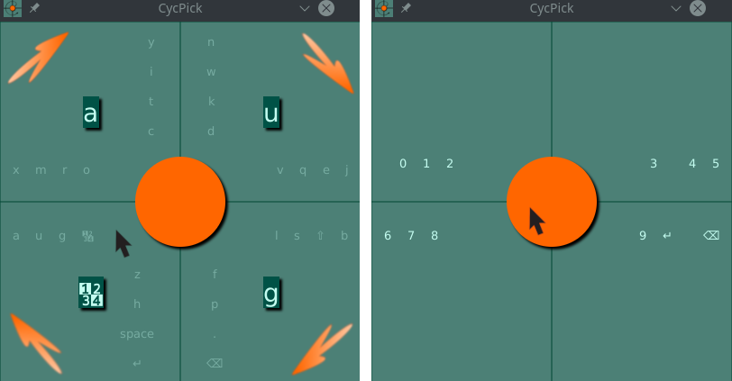
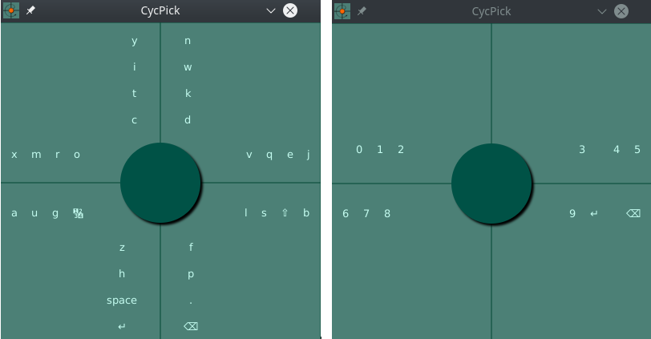

# CycPick 

CycPick is a desktop program, inspired by 8Vim and other Vim-like tools, whose main idea is to assist you in choosing an option in a set of many options.

## Screenshots

### Selecting 8th group  
  

### Swapping layout (choosing choice with subchoices)  
  

### Layout example of efficient layout (optimized for English & Serbian letters)  
  

# Details

This project is detailed in seminar work which can be found [here](./docs/Seminarski_rad-Srđan_Todorović-CycPick.pdf) (note: it's written in Serbian).

# Licence

This program is free (libre) software licenced under [Gnu Public Licence 3](https://www.gnu.org/licenses/gpl-3.0.en.html). 
You can find licence file [here](./LICENSE)
